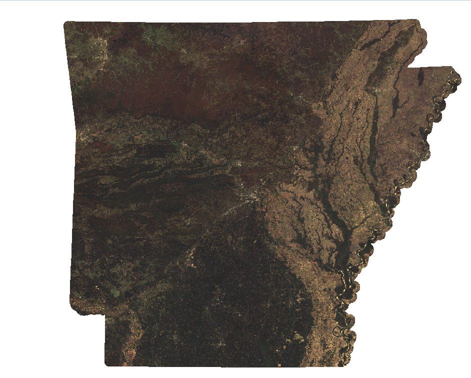

# Sentinel-2 Basemap Generation Pipeline

Pipeline for generating monthly Sentinel-2 satellite imagery basemaps over large areas with state-of-the-art cloudmasking.

## VAST GPU Selection

This pipeline is setup with processing on Vast AI for the GPU in mind. Use `create_env.sh` to quickly get an environment called `mosaics` ready, then activate it. If you are on your own GPU and already have conda, then just create the environment with `environment.yml`.

### GPU selection and storage needed

#### GPU Selection

I use an A100 or something similar and in my setup (monthly mosaic for Arkansas), the whole processing time is around 3 hours costing around $5.

#### Storage Requirements

For the state of Arkansas, for a single month in 2025 where Sentinel A, B and C are operational, it requires around 300GB of disk space. You can calculate roughly how many GB you will need based on this formula based on your area of interest and the number of days in your mosaic:

Required_GB = square_miles * days * 0.00019

Note that this is a rough calculation and you might want to bump it up to be safe. The pipeline is set to use as little storage as possible, so the clipping script (step 2) after download will delete the downloaded files after they are clipped to the AOI.

## Monitoring

You can create a Slack webhook and add it to the `config.json` to get updates at each step. The pipeline will send notifications after key processing stages.

## Algorithm Overview

### Dual Cloud Masking

**[OmniCloudMask](https://github.com/DPIRD-DMA/OmniCloudMask)**: Deep learning model processes RGB+NIR bands, outputs classification (0=clear, 1=thick cloud, 2=thin cloud, 3=shadow)

**SCL Filter**: Sentinel-2 Scene Classification Layer masks clouds, shadows, saturated pixels, and snow

**Combined Logic**: Pixel is invalid if `(OmniCloudMask > 0) OR (SCL in invalid_classes) OR (nodata)`

### Percentile Compositing

For each pixel location, the algorithm:
1. Collects all valid observations across scenes
2. Computes 25th percentile per band (configurable in `config.json`)
    - This percentile approach selects relatively darker/clearer pixel values while avoiding extreme outliers

### Final Mosaic

The final mosaic contains 4 bands, RGB and NIR. It is clipped to the provided GeoPackage.

*An example mosaic for the state of Arkansas using the Arkansas_5000mbuffer.gpkg file for the month of November, 2025*

## Pipeline Steps

```bash
bash pipeline.sh
```

1. **Download & Discovery**: `downloadS2.py` queries STAC API and downloads from AWS
2. **Clipping**: `clipData_parallel.py` clips scenes to AOI, removes originals
3. **Cloud Masking**: `omnimask.py` generates OmniCloudMask per scene
4. **Mosaic Generation**: `generate_mosaic.py` creates percentile composite
5. **Finalization**: `finalize_and_upload.py` uploads to cloud storage, sends notifications

## Configuration

Edit `config.json`:

**Essential Parameters:**
- `target_crs`: Output coordinate system (e.g., "EPSG:32615")
- `bbox`: AOI geometry file (e.g., "Arkansas_5000mbuffer.gpkg") 
- `percentileValue`: Compositing percentile (default: 25)
- `output_filename_base`: Base name for output files (e.g., "Arkansas_S2_RGBNIR")

**Processing:**
- `download_dir`, `cleaned_dir`, `output_dir`: Data directories
- `remove_original_files_after_clipping`: Save disk space (default: true)

## Output Products

- **`{output_filename_base}_{YYYY_MM_DD}_to_{YYYY_MM_DD}.tif`**: 4-band RGBNIR composite (COG format)
- **`metadata.json`**: Source URLs, timestamps, Copernicus attribution

Final files are named according to the actual date range from start_date to end_date in config.json.

## Troubleshooting

**GPU Memory Issues:** 

Reduce `chunk_size` in `omnimask.py` if you get OOM error.

Reduce `GPU_CHUNK_SIZE` in `generate_mosaic.py`
